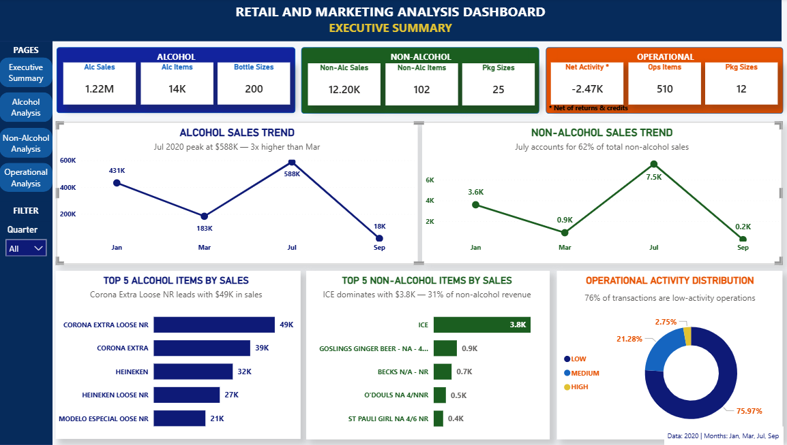
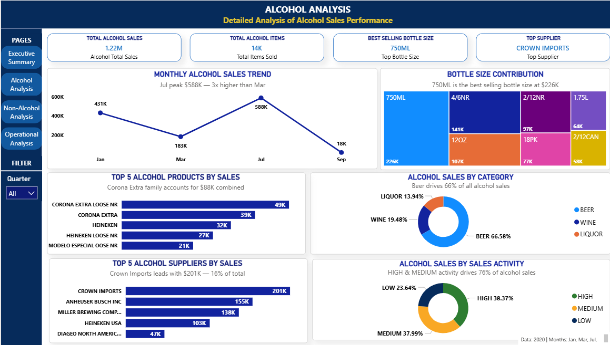
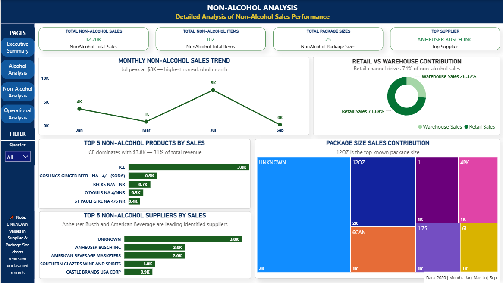
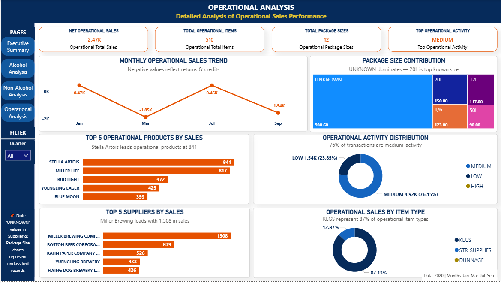

# 🛒 Retail & Marketing Analytics — End-to-End Data Analytics Project

---

## 📌 Project Overview

Complete end-to-end data analytics project analyzing retail sales performance across Alcohol, Non-Alcohol and Operational categories — from raw data extraction to interactive dashboard.

---

## 🔧 Tech Stack

| Tool | Purpose |
|---|---|
| Python | Data Cleaning & EDA |
| Pandas | Data Manipulation |
| Matplotlib & Seaborn | Data Visualization |
| Power BI | Interactive Dashboard |
| Kaggle | Data Source |
| GitHub | Version Control |

---

## 🔄 Project Workflow

### 1️⃣ Data Extraction
- Dataset downloaded directly from Kaggle using KaggleHub
- Raw retail sales transaction data

### 2️⃣ Data Cleaning
- Standardized column names
- Removed RMS ITEM placeholder records
- Removed REF credit adjustment records
- Handled missing supplier values with UNKNOWN
- Converted item_code to integer
- Retained negative values for business analysis

### 3️⃣ Dataset Segmentation
- Master dataset split into 3 focused categories
- **Alcohol** → WINE, BEER, LIQUOR records
- **Non-Alcohol** → NON-ALCOHOL records
- **Operational** → STR_SUPPLIES, KEGS, DUNNAGE records
- Each category analysed independently for focused insights

### 4️⃣ Feature Engineering
- Extracted bottle sizes using Regex
- Created bottle categories (SMALL / MEDIUM / STANDARD / LARGE)
- Created package size features
- Calculated total_sales column
- Generated quarter feature
- Created sales activity classification (LOW / MEDIUM / HIGH)
- Created operational activity classification

### 5️⃣ Exploratory Data Analysis
- Monthly and quarterly trend analysis
- Supplier contribution analysis
- Product performance analysis
- Package and bottle size behavior
- Sales channel analysis (Retail vs Warehouse)
- Correlation analysis
- Activity distribution analysis

### 6️⃣ Power BI Dashboard
4-page interactive dashboard:
- Executive Summary
- Alcohol Analysis
- Non-Alcohol Analysis
- Operational Analysis

---

## 📊 Dashboard Preview

### Executive Summary

### Alcohol Analysis

### Non-Alcohol Analysis

### Operational Analysis

---

## 💡 Key Business Insights

### 🍺 Alcohol
- Total Alcohol Sales: **$1.22M**
- Top Product: **Corona Extra Loose NR — $49K**
- Top Supplier: **Crown Imports — $200K**
- Beer dominates at **66% of total alcohol sales**
- 750ML is the best selling bottle size at **$226K**
- July 2020 was peak month at **$588K — 3x higher than Mar**

### 🧃 Non-Alcohol
- Total Non-Alcohol Sales: **$12.20K**
- Top Product: **ICE — $3.8K (31% of revenue)**
- Top Supplier: **Anheuser Busch Inc**
- Retail channel drives **74% of non-alcohol sales**
- July 2020 recorded highest non-alcohol sales at **$7.5K**

### 🏭 Operational
- Net Operational Activity: **-$2.47K**
- Negative value reflects returns and credits
- Top Supplier: **Miller Brewing Company — 1,508**
- KEGS represent **87% of operational item types**
- MEDIUM activity dominates at **76% of transactions**

---
## 💼 Business Recommendations

### 🍺 Alcohol
- 📅 **Focus marketing in summer months** — July 
  is consistently peak month at $588K
- 🍺 **Prioritize Beer category** — drives 66% 
  of total alcohol revenue
- 🤝 **Strengthen Crown Imports relationship** — 
  top supplier at $200K — critical vendor
- 🏆 **Promote Corona Extra family** — contributes 
  $88K combined — highest selling product line

### 🧃 Non-Alcohol
- 🧊 **Stock ICE heavily in summer** — single 
  product drives 31% of non-alcohol revenue
- 🏪 **Focus on retail channel** — drives 74% 
  of non-alcohol sales vs warehouse
- 🤝 **Build Anheuser Busch relationship** — 
  top identified non-alcohol supplier

### 🏭 Operational
- 📉 **Investigate returns & credits** — net 
  negative balance of -$2.47K needs attention
- 📦 **Review UNKNOWN package classifications** — 
  largest operational category is unclassified
- 🏆 **Monitor Miller Brewing closely** — top 
  operational supplier at 1,508 units
---

## 📅 Data Information

| Detail | Info |
|---|---|
| Source | Kaggle |
| Period | 2020 |
| Available Months | Jan, Mar, Jul, Sep |
| Alcohol Records | 28,892 rows |
| Non-Alcohol Records | 215 rows |
| Operational Records | 884 rows |
| Total Records | 29,991 rows |

---

## 👤 Author

Rupali Patra
- 💼 LinkedIn: www.linkedin.com/in/rupali-patra-260aa2b9
- 🐙 GitHub: https://github.com/PatraRupali